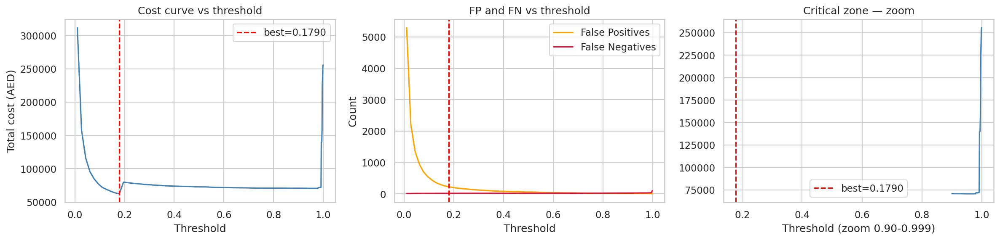
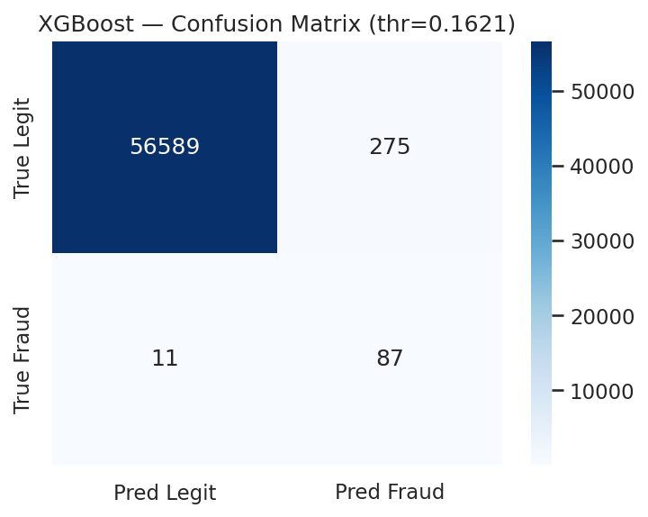
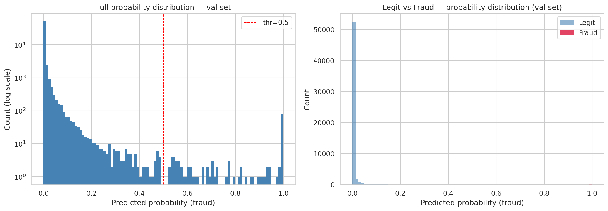
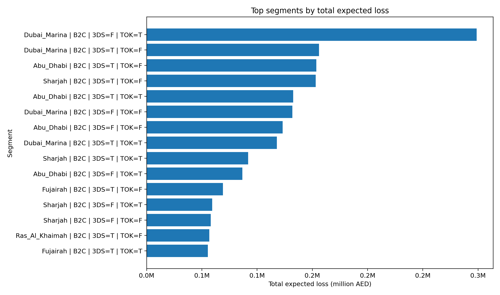

# Credit Card Fraud Detection — XGBoost ML Pipeline with PostgreSQL Backend

> End-to-end fraud detection pipeline: XGBoost classifier trained on UAE credit card data, PostgreSQL analytics schema, cost-aware scoring with expected loss (AED), and investigation queue generation.

---

## Table of Contents

- [Project Overview](#project-overview)
- [Architecture](#architecture)
- [Dataset](#dataset)
- [ML Pipeline](#ml-pipeline)
  - [Models](#models)
  - [Threshold Tuning](#threshold-tuning)
  - [Results — XGBoost (Test Set)](#results--xgboost-test-set)
  - [Ensemble Layer](#ensemble-layer)
  - [Business Impact Simulation](#business-impact-simulation)
- [SQL Backend](#sql-backend)
  - [Schema](#schema)
  - [Views](#views)
- [Scripts](#scripts)
- [Project Structure](#project-structure)
- [Setup & Usage](#setup--usage)
- [Key Charts](#key-charts)
- [Tech Stack](#tech-stack)


---

## Project Overview

This project implements a **production-oriented fraud detection pipeline** for credit card transactions in a UAE financial context. It combines:

- A supervised **XGBoost classifier** with cost-based threshold tuning
- An unsupervised **anomaly detection layer** (Isolation Forest + LOF) for transactions missed by the main model
- A full **PostgreSQL data warehouse** (partitioned fact table, dimensions, scoring tables, analytics views)
- **Python scripts** that act as a glue layer between the ML model and the database
- An **investigation queue** ranked by expected financial loss (AED), ready for analyst review

The pipeline is designed around a real business objective: minimising total cost (false negatives × fraud cost + false positives × review cost), not just optimising accuracy.

---

## Architecture

```
Raw CSV Dataset
      │
      ▼
┌─────────────────────────┐
│  fraud_detection_v4     │  ← Jupyter Notebook
│  .ipynb                 │    Train / Val / Test split (60/20/20)
│                         │    XGBoost + IsolationForest + LOF
│                         │    Cost-based threshold tuning
│                         │    Exports: xgb_v4.pkl, scaler_v4.pkl
└────────────┬────────────┘
             │
             ▼
┌─────────────────────────┐
│  01_schema.sql          │  ← PostgreSQL schema
│  02_load.sql            │    Staging → Dimensions → Partitioned Fact
│  03_views.sql           │    Analytics views + expected loss
│  04_scoring_bridge.sql  │    Bridge view for Python merge
└────────────┬────────────┘
             │
             ▼
┌─────────────────────────┐
│  write_scores.py        │  ← Loads model, scores transactions,
│                         │    writes to fraud.model_scores via psycopg2
└────────────┬────────────┘
             │
             ▼
┌─────────────────────────┐
│  make_charts.py         │  ← Reads from DB outputs (CSV exports),
│                         │    generates monitoring charts
└────────────┬────────────┘
             │
             ▼
   investigation_queue_full.csv   (top 500 by expected loss)
   daily_monitoring_full.csv      (fraud rate per day)
   assets/charts/*.png
```

---

## Dataset

| Property | Detail |
|---|---|
| Base dataset | [Kaggle — Credit Card Fraud Detection](https://www.kaggle.com/datasets/mlg-ulb/creditfraud) |
| Enhanced by | Custom UAE features added by me |
| Final file | `creditcard_enhanced_UAE_FINAL.csv` |
| Features added | `transaction_type` (B2C/B2B), `geo_area`, `customer_id`, `customer_type` (EXPAT/LOCAL), `age`, `is_3DS`, `is_tokenized` |
| Original features | `V1`–`V28` (PCA-anonymised), `Time`, `Amount`, `Class` |
| Cost feature | `cost_if_fraud = Amount × 4.19` (AED multiplier) |
| Class imbalance | ~578:1 (legitimate vs fraud) in training set |
| Train / Val / Test | 60% / 20% / 20% (stratified, no leakage) |

> ⚠️ The original Kaggle CSV is **not included** in this repository due to size and licensing. Download it from Kaggle and apply the UAE feature augmentation as described in the notebook.

---

## ML Pipeline

### Models

| Model | Role |
|---|---|
| **XGBoost** (`XGBClassifier`) | Primary supervised classifier |
| **IsolationForest** | Unsupervised anomaly detection (fitted on legit train txns only) |
| **LocalOutlierFactor** | Secondary unsupervised layer |
| **StandardScaler** | Feature scaling (fit on train only, applied to val/test) |

### Threshold Tuning

The decision threshold is **not** set at the default 0.5. Instead, it is selected by minimising total validation cost:

```
Total Cost = Σ (FP × cost_fp_unit) + Σ (FN × cost_if_fraud)
```

- `cost_fp_unit` = 50 AED (manual review)
- `cost_manual_unit` = 200 AED (high-value transactions ≥ 50K AED)
- `cost_if_fraud` = transaction amount × 4.19

**Best threshold (validation set): `0.1790`**  
**Minimum cost (validation set): `62,400.62 AED`**

The threshold used in `write_scores.py` is `0.1621` (production deployment value after final calibration).

### Results — XGBoost (Test Set)

**Confusion Matrix:**

|  | Predicted Legit | Predicted Fraud |
|---|---|---|
| **Actual Legit** | 56,589 (TN) | 275 (FP) |
| **Actual Fraud** | 11 (FN) | 87 (TP) |

**Classification Report:**

| Class | Precision | Recall | F1-score | Support |
|---|---|---|---|---|
| 0 — Legitimate | 0.9998 | 0.9952 | 0.9975 | 56,864 |
| 1 — Fraud | 0.2403 | **0.8878** | 0.3783 | 98 |
| **Accuracy** | | | **0.9950** | 56,962 |
| Macro avg | 0.6201 | 0.9415 | 0.6879 | |
| Weighted avg | 0.9985 | 0.9950 | 0.9964 | |

> The model is intentionally tuned for **high recall on fraud** (88.78%) at the cost of lower precision — in a fraud context, missing a fraud (FN) is far more costly than a false alarm (FP).

### Ensemble Layer

An ensemble combining XGBoost with the unsupervised layer (IForest OR LOF) was evaluated on the test set:

| | TP | FP | FN | Recall (fraud) | Precision (fraud) |
|---|---|---|---|---|---|
| XGBoost alone | 87 | 275 | 11 | 0.8878 | 0.2403 |
| Ensemble (XGB OR unsup) | 87 | 611 | 11 | 0.8878 | 0.1246 |

**Decision:** XGBoost alone is used in production (`write_scores.py`). The ensemble adds +336 false positives with zero additional fraud caught, making it suboptimal at this threshold.

Unsupervised model outputs are stored in `fraud.anomaly_scores` for future analysis.

### Business Impact Simulation

Simulated on test set, projected to annual volume of **12,000,000 transactions**:

| Cost Component | Estimated Annual (AED) |
|---|---|
| False positive review cost | 2,886,590.70 |
| False negative (missed fraud) cost | 1,758,731.82 |
| Manual review — high value (≥50K) | 379,260.09 |
| **Total estimated annual cost** | **5,024,582.61** |

- Frauds caught on test set: **87 / 98** (value: 127,677.22 AED)
- Frauds missed: **11** (cost: 8,347.09 AED)

---

## SQL Backend

### Schema

PostgreSQL 15+ schema `fraud` with:

| Table | Description |
|---|---|
| `stg_transactions` | Raw staging table — CSV ingested by position via `COPY` |
| `dim_geo_area` | Geographic area dimension |
| `dim_customer` | Customer dimension (type, age) |
| `fact_transactions` | Core fact table, **partitioned by date** (3 daily partitions + default) |
| `model_scores` | XGBoost risk scores per transaction per model version |
| `anomaly_scores` | IsolationForest + LOF flags |
| `alerts` | Alert records with severity (1–5) and JSONB details |

**Notable design choices:**
- `fact_transactions` uses `PARTITION BY RANGE (transaction_date)` — composite PK `(transaction_id, transaction_date)` required by Postgres partitioning rules
- Generated columns: `is_fraud BOOLEAN`, `cost_if_fraud NUMERIC`, `flag_over_50k BOOLEAN`
- All FKs cascade on delete

### Views

| View | Description |
|---|---|
| `v_fraud_rate_by_geo` | Fraud rate and volume by geographic area |
| `v_fraud_rate_by_controls` | Fraud breakdown by transaction_type × is_3DS × is_tokenized |
| `v_daily_monitoring` | Daily fraud rate, transaction count, amounts |
| `v_customer_risk_profile` | Per-customer fraud rate, max amount, high-value flag count |
| `v_latest_model_score` | LATERAL join — picks the most recent score per transaction |
| `v_expected_loss` | `risk_score × cost_if_fraud` = expected loss in AED |
| `v_investigation_queue` | Top 500 transactions by expected loss — analyst investigation queue |
| `v_scoring_bridge` | Bridge view used by `write_scores.py` for transaction_id merge |

---

## Scripts

### `write_scores.py`

Connects the trained model to the PostgreSQL database:

1. Loads `xgb_v4.pkl`, `scaler_v4.pkl`, `train_columns_v4.pkl`
2. Reads the full dataset CSV
3. Applies identical preprocessing as the notebook (binary encoding, one-hot, scaling)
4. Computes `risk_score` and `flag_xgb` using threshold `0.1621`
5. Fetches `v_scoring_bridge` from the DB to retrieve `transaction_id`
6. Merges on `(time_seconds, customer_id, amount)` to align IDs
7. Bulk-inserts into `fraud.model_scores` via `psycopg2.extras.execute_values`

**Environment variables:**

| Variable | Default | Description |
|---|---|---|
| `CSV_PATH` | hardcoded path | Path to the enhanced dataset CSV |
| `MODEL_PATH` | `xgb_v4.pkl` | Trained XGBoost model |
| `SCALER_PATH` | `scaler_v4.pkl` | Fitted StandardScaler |
| `COLUMNS_PATH` | `train_columns_v4.pkl` | Training column order |
| `THRESHOLD` | `0.1621` | Decision threshold |
| `MODEL_VERSION` | `xgb_v4` | Version tag written to DB |
| `DB_HOST` | `localhost` | PostgreSQL host |
| `DB_PORT` | `5432` | PostgreSQL port |
| `DB_NAME` | `frauddb` | Database name |
| `DB_USER` | `utente1` | Database user |
| `DB_PASSWORD` | — | Database password |

### `make_charts.py`

Reads CSV exports from the database outputs and generates 4 monitoring charts saved to `assets/charts/`:

| Chart | Description |
|---|---|
| `01_fraud_rate_over_time.png` | Fraud rate (%) per day |
| `02_expected_loss_distribution.png` | Histogram of expected loss (log scale) |
| `03_top_segments_expected_loss.png` | Top 15 segments (geo × type × controls) by total expected loss |
| `04_top20_expected_loss.png` | Top 20 individual transactions by expected loss |

---

## Project Structure

```
credit-card-fraud-xgboost/
│
├── README.md
├── .gitignore
├── requirements.txt
│
├── notebooks/
│   └── fraud_detection_v4.ipynb       # Full ML pipeline
│
├── sql/
│   ├── 01_schema.sql                  # Schema, tables, indexes
│   ├── 02_load.sql                    # Staging → dimensions → fact
│   ├── 03_views.sql                   # All analytics views
│   └── 04_scoring_bridge.sql          # Bridge view for write_scores.py
│
├── scripts/
│   ├── write_scores.py                # Model → PostgreSQL scoring writer
│   └── make_charts.py                 # Chart generation from DB exports
│
├── assets/
│   ├── cm_xgboost.png                 # Confusion matrix — XGBoost
│   ├── cm_comparison.png              # XGBoost vs Ensemble comparison
│   ├── prob_distribution_val.png      # Score distribution on validation set
│   ├── threshold_tuning_curve.png     # Cost vs threshold curve
│   ├── 01_fraud_rate_over_time.png
│   ├── 02_expected_loss_distribution.png
│   ├── 03_top_segments_expected_loss.png
│   └── 04_top20_expected_loss.png
│
├── data/
│   ├── investigation_queue_full.csv   # Top 500 transactions by expected loss
│   └── daily_monitoring_full.csv      # Daily fraud monitoring summary
│
└── models/
    ├── xgb_v4.pkl                     # Trained XGBoost model
    ├── scaler_v4.pkl                  # Fitted StandardScaler
    └── train_columns_v4.pkl           # Feature column order
```

---

## Setup & Usage

### Prerequisites

- Python 3.9+
- PostgreSQL 15+
- The base Kaggle dataset (`creditcard.csv`) with UAE features applied

### 1. Install dependencies

```bash
pip install -r requirements.txt
```

**`requirements.txt`:**
```
xgboost
scikit-learn
pandas
numpy
matplotlib
seaborn
psycopg2-binary
joblib
```

### 2. Set up the database

```bash
psql -U your_user -d your_db -f sql/01_schema.sql
```

Load your enhanced CSV into staging:
```sql
\copy fraud.stg_transactions FROM 'creditcard_enhanced_UAE_FINAL.csv' CSV HEADER;
```

Populate dimensions and fact table:
```bash
psql -U your_user -d your_db -f sql/02_load.sql
```

Create all views:
```bash
psql -U your_user -d your_db -f sql/03_views.sql
psql -U your_user -d your_db -f sql/04_scoring_bridge.sql
```

### 3. Train the model

Open and run `notebooks/fraud_detection_v4.ipynb` end-to-end. This will produce:
- `xgb_v4.pkl`
- `scaler_v4.pkl`
- `train_columns_v4.pkl`
Place the `.pkl` files in the `models/` directory.

xgb_v4.pkl is included in the models/ directory. No retraining needed to run write_scores.py.

### 4. Write scores to database

```bash
export DB_HOST=localhost
export DB_NAME=frauddb
export DB_USER=your_user
export DB_PASSWORD=your_password
export CSV_PATH=/path/to/creditcard_enhanced_UAE_FINAL.csv

python scripts/write_scores.py
```

### 5. Generate charts

Export `daily_monitoring_full.csv` and `expected_loss_full.csv` from the DB views, then:

```bash
python scripts/make_charts.py
```

### 6. Query the investigation queue

```sql
SELECT * FROM fraud.v_investigation_queue LIMIT 50;
```

---

## Key Charts

| Chart | Description |
|---|---|
|  | Cost vs threshold curve — minimum at 0.1790 |
|  | XGBoost confusion matrix on test set |
|  | Fraud probability distribution on validation set |
|  | Top risk segments by expected financial loss |

---

## Tech Stack

| Layer | Technology |
|---|---|
| ML modelling | Python, XGBoost, scikit-learn (IsolationForest, LOF, StandardScaler) |
| Data manipulation | pandas, numpy |
| Visualisation | matplotlib, seaborn |
| Database | PostgreSQL 15+ (partitioned tables, LATERAL joins, generated columns) |
| DB connector | psycopg2 |
| Model persistence | joblib |
| Notebook | Jupyter |

---

## Author

**lorenzo-damicods**  
This project was built as a complete end-to-end data science portfolio piece, covering the full stack from raw data ingestion to production-ready scoring and SQL-based analytics.  
The dataset is derived from the [Kaggle Credit Card Fraud Detection dataset](https://www.kaggle.com/datasets/mlg-ulb/creditfraud), enhanced with custom UAE-specific features (geography, transaction type, customer profile, security controls).

---

*Model version: `xgb_v4` | Threshold: `0.1621` | PostgreSQL schema: `fraud`*
